<!-- # 产品简介
蜂巢链是一个基于区块链的共享式云计算平台，为平台上开发的应用程序提供可扩展，安全，易于访问的服务、计算资源。

### 产品架构

### 功能特性
##### 数据安全防护
单方数据入链，多重安全机制保障数据安全、防篡改。

##### 交易透明监管
多方交易入链可追溯，智能合约防止交易信息被私自篡改。
##### 数字资产交易
自主数据深度分析，对外开放价值流转。
##### 贸易征信融资
贸易信息入链，金融机构共治共识，融资资金专款专用。

# 加入流程

## 第一步，创建蜂巢链账号
企业和商户需要先在蜂巢链上创建蜂巢链账号，同意蜂巢链网站服务条款，这样才可以接入蜂巢链，注册流程如下。
按住滑块，拖到最右边。填写验证码完成注册。
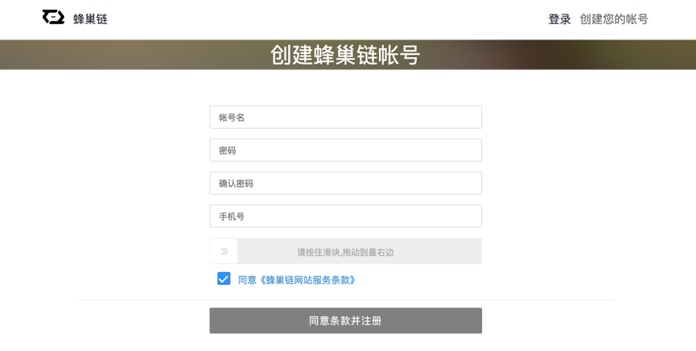  

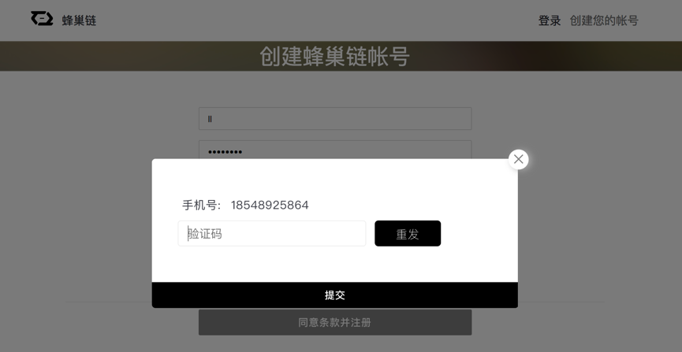

##  第二步，实名认证
这一步需要提交企业营业执照或身份证等信息以便我们实施认证。需要用户提供真实可信的企业信息，认证时间在一星期之内。

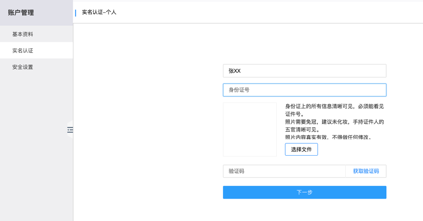

# 专属链
专属链账本基于区块链的分布式账本特性，实现单一中心式数据库合分布式副账本共存。多个共享的账本副本，账本维护由分布式共识算法实现，通过秘钥保障交易双方的私密性。专属链账本仅企业邀请的参与者可见，与不同的私有链上的账本各自独立。这一服务适合企业、产业链及其、联盟组织内部进行贸易往来协作时使用。  

我们可以根据您的需要为您创建不同规格的专属链：体验版、旗舰版以及标准版。您也可以自定义账节点个数、账本副本容量、资产钱包容量以及凭证文件库容量。体验版旗舰版适用于企业联盟链，标准版适用于企业私有链。

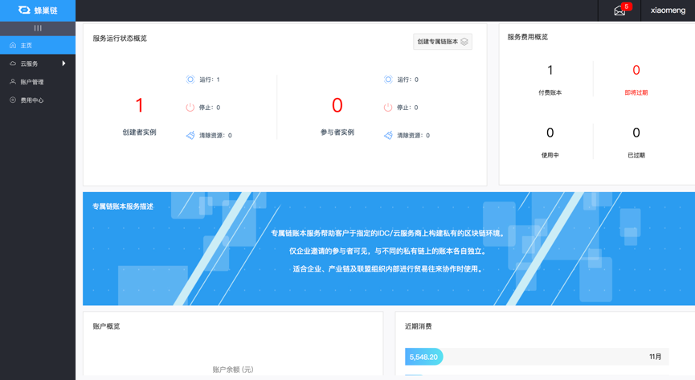

## 创建专属链账本步骤

### 旗舰版专属链账本
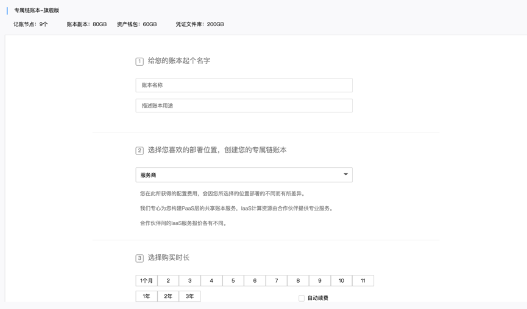

### 自定义配置 -->
<!-- 
用户自定义节点个数、账本副本容量、资产钱包容量、凭证文件容量。为用户量身定做属于自己的专属链账本。
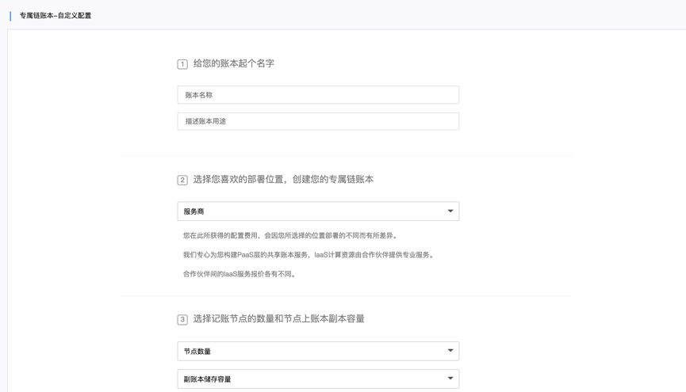
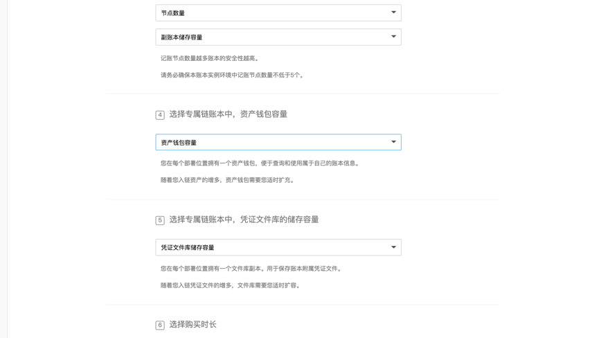
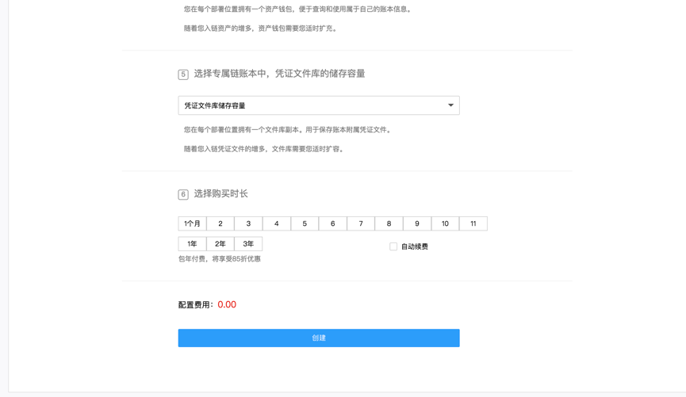

## 专属链管理
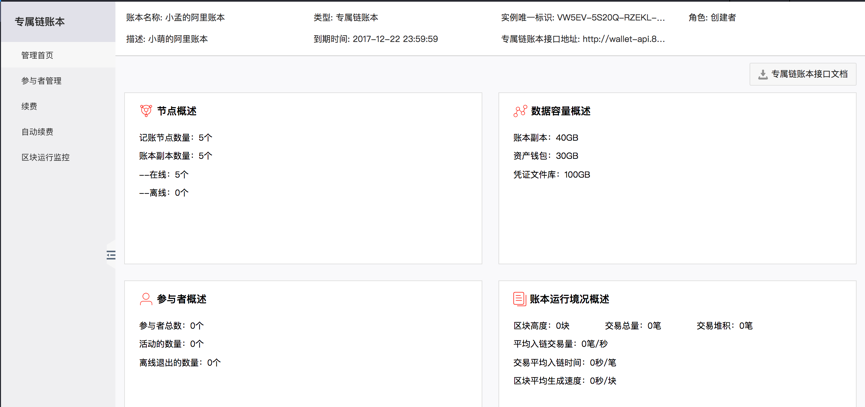

## 参与者管理
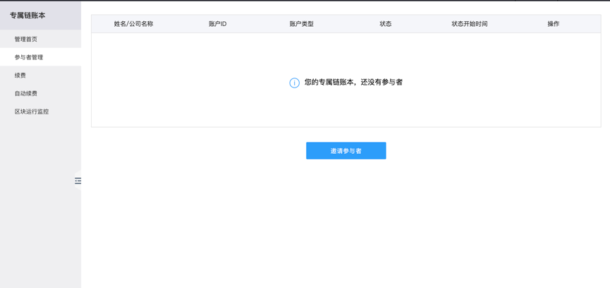

## 续费
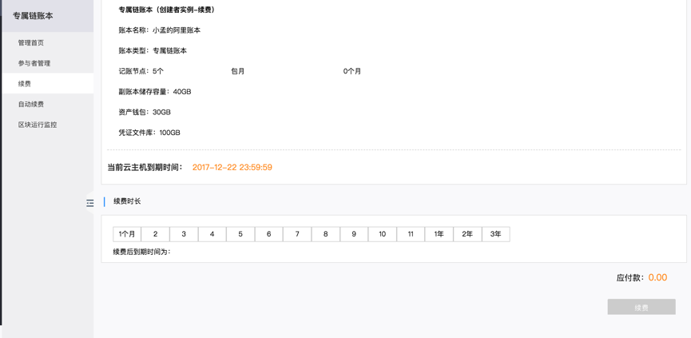

## 自动续费  

服务到期7天前自动扣划用户账户余额 
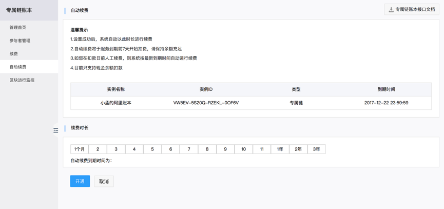   -->

<!-- ## 区块运行监控  

对链上各种交易操作进行监控。 
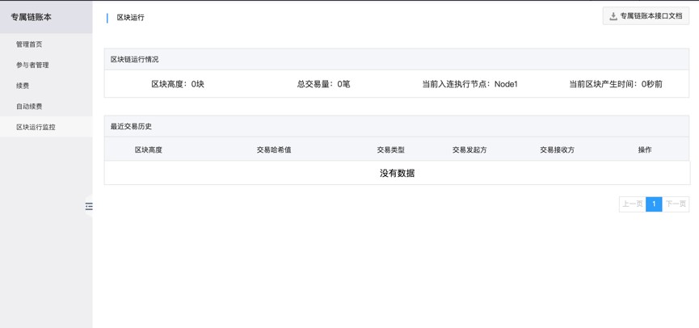 -->

<!-- # 基本概念 
## Smart Contract，智能合约
Smart Contract，智能合约是执行在区块链上面的合约程序，通过区块链提供不可停止的可信计算功能，保障了合约的自由执行， 所以在井通系统中智能合约也称为自由合约。智能合约是解决多方在业务功能执行上面信任的问题，保障多方共同信任某一合约功能的执行， 解决现实世界中执行的可信问题。  
智能合约的执行是不可停止的，所以智能合约需要通过在合约中构建可以满足现实需求的合约功能，包括监督、行政以及监管的功能， 通过合约本身的机制来符合业务的需求。  
井通智能合约提供基本的、可靠的合约模板满足基本的大部分的合约需求，同时也提供自由编程的模式，为合约高级用户提供丰富的功能， 基本的功能包括合约部署，合约驱动以及合约停止等功能。 -->

蜂巢链是一个基于区块链的共享式云计算平台，为平台上开发的应用程序提供可扩展，安全，易于访问的服务、计算资源。蜂巢链专注于贸易结算，目标是让企业将区块链技术融入自己的IT系统中。