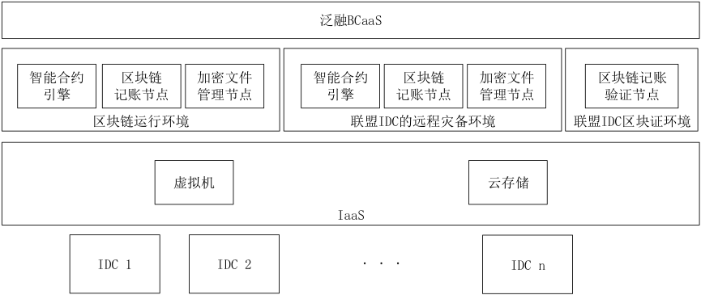

# 产品简介
蜂巢链是一个基于区块链的共享式云计算平台，为平台上开发的应用程序提供可扩展，安全，易于访问的服务、计算资源。蜂巢链专注于贸易结算，目标是让企业将区块链技术融入自己的IT系统中。

# 产品架构

# 功能特性

### 数据安全防护
单方数据入链，多重安全机制保障数据安全、防篡改。

### 交易透明监管
多方交易入链可追溯，智能合约防止交易信息被私自篡改。
### 数字资产交易
自主数据深度分析，对外开放价值流转。
### 贸易征信融资
贸易信息入链，金融机构共治共识，融资资金专款专用。

# 核心技术

### 分布式共享账本框架
基于自主研发的专利技术，一种基于“约瑟夫环三重区块链记账方式”实现的。应用层可进行类SQL查询，平台支持多种接口形式，支持多种主流的开发语言。

### 高效的共识机制
基于自主研发的专利技术，一种“基于随机相关性分析的优化拜占庭共识方法”实现的。支持多种可扩展插件, 确认速度可达到秒级以内。

### 自主智能合约引擎
基于自主研发的专利技术，一种“基于流式计算的任务管理和调度方法”实现的，可扩展性强。

# 使用场景
贸易融资、贸易结算、供应链金融、数字资产管理
