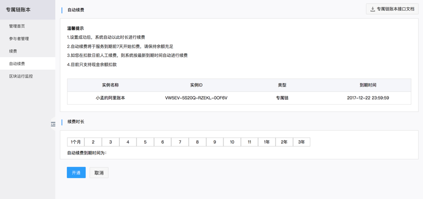

# 专属链

专属链账本基于区块链的分布式账本特性，实现单一中心式数据库合分布式副账本共存。多个共享的账本副本，账本维护由分布式共识算法实现，通过秘钥保障交易双方的私密性。专属链账本仅企业邀请的参与者可见，与不同的私有链上的账本各自独立。这一服务适合企业、产业链及其、联盟组织内部进行贸易往来协作时使用。  

我们可以根据您的需要为您创建不同规格的专属链：体验版、旗舰版以及标准版。您也可以自定义账节点个数、账本副本容量、资产钱包容量以及凭证文件库容量。体验版旗舰版适用于企业联盟链，标准版适用于企业私有链。

# 创建链

## 创建专属链账本步骤

### 旗舰版专属链账本

### 自定义配置

用户自定义节点个数、账本副本容量、资产钱包容量、凭证文件容量。为用户量身定做属于自己的专属链账本。

# 专属链管理

## 参与者管理

# 续费

## 自动续费  

服务到期7天前自动扣划用户账户余额  

  

# 区块监控

对链上各种交易操作进行监控。  

